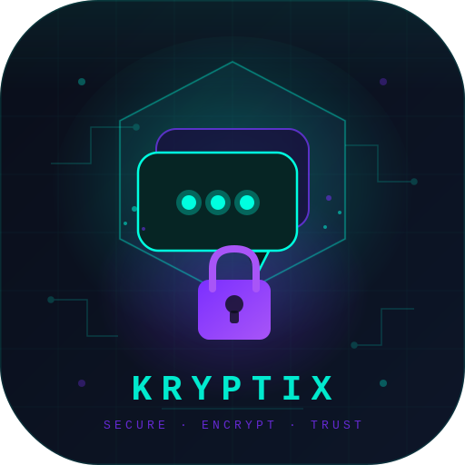

<div align="center">

  

  # 🚀 KRYPTIX

  **⚡ Ultra-fast, secure, and reliable file sharing — better than traditional local send apps.**

  <p>
    <a href="https://kryptix.pages.dev/"></a>
    
    
    
  </p>

</div>

---

## 👨‍💻 About the Project

**Kryptix** is a modern, high-speed file sharing and messaging application designed to work both locally and universally. 

Unlike typical local send apps, Kryptix is:
- **⚡ Faster:** Multi-threaded parallel chunking pushes your network limits.
- **🌐 Universal:** Works across any network (not limited to local LANs).
- **🔒 Secure:** True End-to-End Encryption (AES-256-GCM) ensures your data is safe.
- **🧠 Smart:** Automatically falls back to open relay servers if direct connections fail.

> 💡 Built as a solo project in just **1 week** by a passionate developer! 

⚠️ **Note:** Since this is a rapidly developed project, there might be some bugs. I will definitely fix and improve everything as soon as I get free time! 🙌

---

## ✨ Features

- 🚀 **High-speed file transfer** with zero-bottleneck architecture
- 🌍 **Cross-network communication** using standard STUN/TURN technologies
- 🔐 **Secure messaging system** that operates concurrently with file drops
- 📡 **Multiple server support** (Relay and OpenRelay ready)
- 💻 **Cross-Platform:** Works on Web, Mobile (Capacitor), and Desktop (Electron)

---

## 📱 How to Use

### 1. Open Kryptix
Visit the live portal right now:  
👉 **[https://kryptix.pages.dev/](https://kryptix.pages.dev/)**

### 2. Connect Devices
- Open Kryptix on both devices you want to pair.
- Copy the Connection Code and join the secure session.

### 3. Send Files
- Select your files (or drag and drop).
- Watch them transfer instantly! ⚡

---

## 🛠️ Build it Yourself

### 📦 Mobile App (Capacitor)

```bash
# Install dependencies
npm install
npm install @capacitor/core @capacitor/cli

# Initialize and sync platforms
npx cap init
npx cap add android
npx cap add ios
npx cap sync

# Open Android Studio to build the APK
npx cap open android
```

### 🖥️ Desktop App (Electron)

```bash
# Install Electron as a dev dependency
npm install electron --save-dev

# Run the desktop wrapper natively
npx electron .
```

*(Note: Desktop uses the `desktop-main.js` and `desktop-preload.js` wrappers included in this repository).*

---

## 📸 Screenshots & UI Preview

*(Add your beautiful screenshots here! Place your images in an `assets/` folder and replace these links)*

<div align="center">
  
  
</div>

---

## ❤️ Support Kryptix

If you like this project and want to see faster features, dedicated high-speed servers, and continuous updates, consider supporting the development! 

As I am a student, donations are limited but deeply appreciated 🙌

**UPI ID:** `shasradha@ybl`

*(You can scan the QR code included in this repository to donate via PhonePe!)*

> “This project is free & open-source. If you want faster features, servers, and updates — support development.”

---

## 📜 License & Terms

### License
This project is licensed under the **MIT License**. You are free to:
- ✅ **Use**
- ✅ **Modify**
- ✅ **Distribute**

**Condition:** Credit must be given to the original creator.

### Terms of Use
By using Kryptix, you agree:
- ⚠️ The software is provided "as is" without warranty.
- 🔒 You are responsible for how you use this tool.
- 🚫 Do not use for illegal or harmful activities.
- 🛠️ The developer is not responsible for data loss or misuse.

---

## 👑 Credits

**KRYPTIX** — Built with passion, speed, and vision 🚀  
Made by **Shasradha Karmakar**

- 🔗 **GitHub:** [https://github.com/shasradha](https://github.com/shasradha)
- 🌐 **Portfolio:** [https://shasradha.pages.dev/](https://shasradha.pages.dev/)
- 📧 **Email:** codewithyuv@gmail.com

### ⭐ Support & Feedback
If you like this project:
- ⭐ **Star the repository**
- 🍴 **Fork it**
- 🧠 **Suggest improvements**
